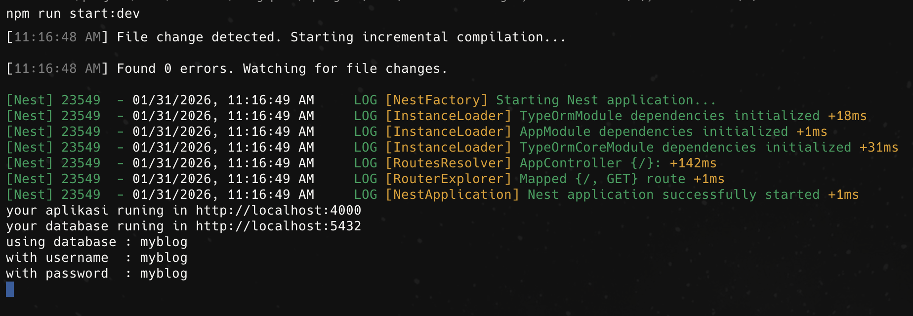

## TypeORM Setup

1. Create folder `src/database` and create file `typeormConfig.ts`

```bash
mkdir src/database
touch src/database/typeormConfig.ts
touch .env
```

2. Insert the following code to `typeormConfig.ts`

```typescript
import 'dotenv/config';
import { TypeOrmModuleOptions } from '@nestjs/typeorm';
import { join } from 'path';
import { DataSource, DataSourceOptions } from 'typeorm';

export const dataSourceOptions: DataSourceOptions = {
  type: 'postgres',
  host: process.env.DB_HOST ?? 'localhost',
  port: Number(process.env.DB_PORT ?? 5432),
  username: process.env.DB_USERNAME ?? 'postgres',
  password: process.env.DB_PASSWORD ?? 'postgres',
  database: process.env.DB_NAME ?? 'mydatabase',
  entities: [join(__dirname, '..', '**', '*.entity.{ts,js}')],
  migrations: [join(__dirname, 'migrations', '*.{ts,js}')],
  synchronize: false,
};

export const typeOrmConfig: TypeOrmModuleOptions = {
  ...dataSourceOptions,
  autoLoadEntities: true,
  synchronize: (process.env.DB_SYNCHRONIZE ?? 'false') === 'true',
};

export const dataSource = new DataSource(dataSourceOptions);
```

3. Update `app.module.ts` with TypeORM Module, follow the code below.

```typescript
import { Module } from '@nestjs/common';
import { TypeOrmModule } from '@nestjs/typeorm';
import { AppController } from './app.controller';
import { AppService } from './app.service';
import { typeOrmConfig } from './database/typeormConfig';

@Module({
  imports: [TypeOrmModule.forRoot(typeOrmConfig)],
  controllers: [AppController],
  providers: [AppService],
})
export class AppModule {}
```

4. Update `main.ts` with TypeORM Module, follow the code below.

```typescript
import 'dotenv/config';
import 'reflect-metadata';
import { NestFactory } from '@nestjs/core';
import { AppModule } from './app.module';
import { ValidationPipe } from '@nestjs/common';

async function bootstrap() {
  const port = Number(process.env.PORT ?? 3000);
  const app = await NestFactory.create(AppModule);
  app.useGlobalPipes(
    new ValidationPipe({
      whitelist: true,
      forbidNonWhitelisted: true,
      transform: true,
    }),
  );
  await app.listen(port);
  console.log(`your aplikasi runing in http://localhost:${port}`);
  console.log(
    `your database runing in http://localhost:${process.env.DB_PORT}`,
  );
  console.log(`database : ${process.env.DB_NAME}`);
  console.log(`username : ${process.env.DB_USERNAME}`);
  console.log(`password : ${process.env.DB_PASSWORD}`);
}
void bootstrap();
```

5. Insert code for the file `.env` follow the code below.
   make sure you already have a postgres database.

```bash
psql postgres
```

create database postgres;

```sql
CREATE USER new_user WITH PASSWORD 'password123';
```

```sql
CREATE DATABASE new_database OWNER new_user;
```

in this case, we use `myblog` as the database name, username, and password.

cek database

```sql
\l
```

```env
PORT=4000
DB_HOST=localhost
DB_PORT=5432
DB_USERNAME=myblog
DB_PASSWORD=myblog
DB_NAME=myblog
DB_SYNCHRONIZE=true
```

6. at this stage, let's try to run the project.

```bash
npm run start:dev
```

7. If the project runs successfully, we can see the following message in the console.

```bash
your aplikasi runing in http://localhost:4000
```

same the image

